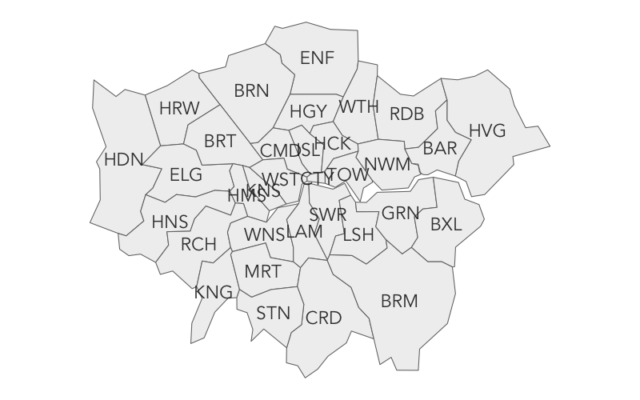
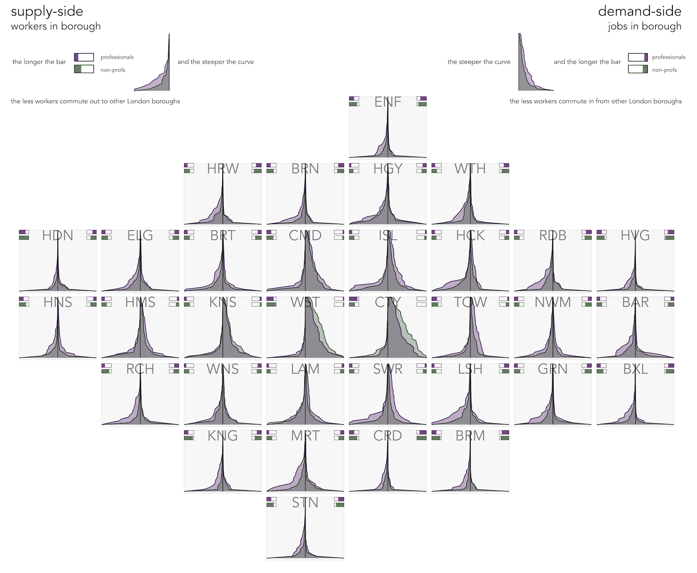
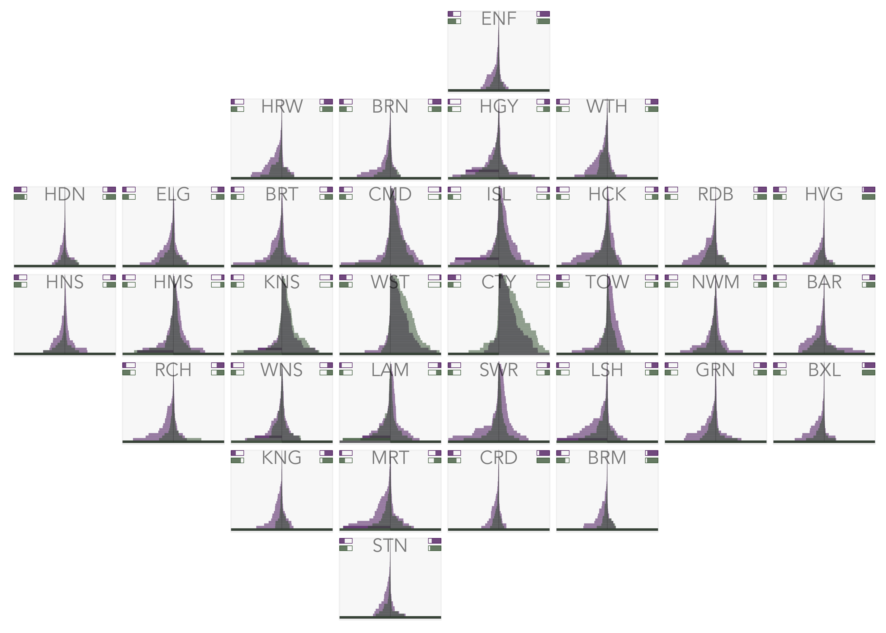
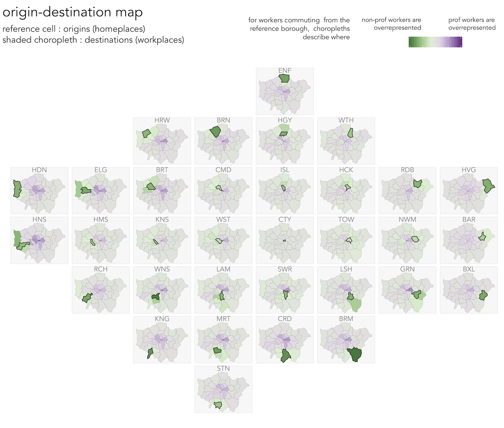
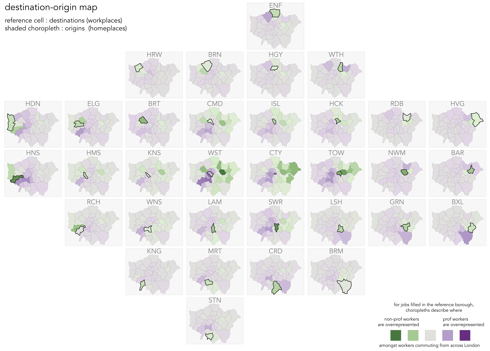

# Code to support Featured Graphic submission: Characterising labour market self-containment in London with geographically arranged small multiples

* [Roger Beecham](http://www.roger-beecham.com) 
* [Aidan Slingsby](http://www.staff.city.ac.uk/~sbbb717/) 

This repository contains code behind our Featured Graphic submission: _Characterising labour market self-containment in London with geographically arranged small multiples_. The intention was to provide a fully reproducible repository to support the submission. We are not able to do this for reasons of data access: the data on which the submission is based is restricted to registered users of [UK Data Service](https://www.ukdataservice.ac.uk). As a result this repo is non-functional and the code should be considered skeleton/indicative. However, I have previously published a repo demonstrating much of what appears below on a version of the dataset that is publicly available, again using R libraries (`ggplot2` and `sf`): [od-flowvis-ggplot2](https://github.com/rogerbeecham/od-flowvis-ggplot2). If you would like more information/help, do get in touch: [rJBeecham](https://twitter.com/rJBeecham). 

## Dependencies and data

Configure R with libraries on which featured graphic depends and helper functions.

```{r, eval=FALSE}
# Libraries

# Bundle of packages supporting Tidy data analysis. 
# -v2.3 of ggplot2 necessary to support geom_sf.
library(tidyverse)
# For working with geometries.
library(sf)
# For simplifying geometries.
library(rmapshaper)
# ggplot2 extension for animated graphics (requires transformr).
library(gganimate)
# Set default ggplot2 theme.
theme_set(theme_minimal(base_family="Avenir Book"))
# Helper functions.
# For rescaling.
map_scale <- function(value, min1, max1, min2, max2) {
  return  (min2+(max2-min2)*((value-min1)/(max1-min1)))
}
```

Load and process data:

* OD data by occupation at msoa level from [UK Data Service](https://www.ukdataservice.ac.uk)
* LondonSquared layout via [After the flood](https://aftertheflood.com/projects/future-cities-catapult/)
* Boundary data via [ONS Open Geography](http://geoportal.statistics.gov.uk/)

```{r, eval=FALSE}
# Load and process data.
source("./src/load_data.R")
```

## Explore extent of distortion in LondonSquared layout

```{r, eval=FALSE}
# Make sf object of LondonSquared layout
grid_sf <- st_sf(geom=st_make_grid(london_boundaries, n=c(8,7), what="polygons")) %>% mutate(id=row_number())
# Store gid cell locations and add as fields.
x <- rep(1:8,7)
y <- vector(length=length(x))
for(i in 1:7) {
      for(j in 1:8) {
       index=(i-1)*8+j
       y[index] <- map_scale(i,1,7,7,1)
      }  
  }
grid_sf <- grid_sf %>% add_column(x=x, y=y) %>% 
  inner_join(london_centroids, by=c("x"="fX", "y"="fY")) %>% 
  st_cast(to="MULTIPOLYGON") %>% 
  rename("geometry"="geom") %>%
  arrange(panel) %>%
  mutate(id=row_number(), type="grid") 
# Calculate grid centroids for relabelling.
grid_centroids <- grid_sf %>% st_centroid() %>% st_coordinates() %>% as_tibble() %>% rename("east"="X", "north"="Y")
# Add to grid_sf
grid_sf <- grid_sf %>%
  mutate(east=grid_centroids$east, north=grid_centroids$north)
rm(grid_centroids)  
# Copy if london_boundaries with same fields as grid_sf for rbind().
real_sf <- london_boundaries %>% select(lad15cd) %>%
  left_join(london_centroids, by=c("lad15cd"="ladcd")) %>%
    arrange(panel) %>%
    mutate(id=row_number(), x=fX, y=fY, type="real") %>%
    select(id,x,y,east,north,ladcd=lad15cd,ladnm,BOR,panel,type) 
# rbind() in order to lerp between layouts.
grid_real_sf <- rbind(grid_sf,real_sf) %>% 
  mutate(type=fct_relevel(as_factor(type), "real","grid"))
# Animate between two layouts using gganimate package.
grid_real_sf %>%
  ggplot()+
  geom_sf(fill="#f0f0f0", colour="#737373", size=0.5)+ 
  coord_sf(datum=NA)+
  geom_text(aes(x=east, y=north, label=BOR), size=8, colour="#252525", alpha=0.9, show.legend=FALSE, family="Avenir Book")+
  transition_states(type, 1, 2)+
  theme(axis.title=element_blank())

animate(trans, renderer = gifski_renderer("./figures/gganim.gif"), height = 500, width=800)
```  


## Rank-size distributions

### Using area charts

  
```{r, eval=FALSE}
local_scale_distributions_area <- ggplot()+
  # Facet background.
  geom_rect(data=demand_side, aes(xmin=0, xmax=33, ymin=-1, ymax=1), fill="#f7f7f7", colour="#f0f0f0")+
  # Lines for distributions.
  geom_line(data=demand_side, aes(x=prof_rank, y=prof/prof_max_jobs), colour="#40004b", alpha=0.9, size=0.4)+
  geom_line(data=demand_side, aes(x=non_prof_rank, y=non_prof/non_prof_max_jobs), colour="#00441b", alpha=0.9, size=0.4)+
  geom_line(data=supply_side, aes(x=prof_rank, y=-prof/prof_max_workers), colour="#40004b", alpha=0.9, size=0.4)+
  geom_line(data=supply_side, aes(x=non_prof_rank, y=-non_prof/non_prof_max_workers), colour="#00441b", alpha=0.9, size=0.4)+
  # Areas for distributions.
  geom_area(data=demand_side, aes(x=prof_rank, y=prof/prof_max_jobs), fill="#40004b", alpha=0.3)+
  geom_area(data=demand_side, aes(x=non_prof_rank, y=non_prof/non_prof_max_jobs), fill="#00441b", alpha=0.3)+
  geom_area(data=supply_side, aes(x=prof_rank, y=-(prof/prof_max_workers)),fill="#40004b", alpha=0.3)+
  geom_area(data=supply_side, aes(x=non_prof_rank, y=-(non_prof/non_prof_max_workers)), fill="#00441b", alpha=0.3)+
  # Text labels for boroughs.
  geom_text(data=demand_side, aes(x=33, y=0, label=bor_label), family="Avenir Book", alpha=0.5, hjust="centre", vjust="top", size=6)+
  # Bars for direct encoding of self-containment metric.
  geom_rect(data=supply_side %>% filter(d_bor==bor_focus), aes(xmin=31, xmax=33, ymin=-1, ymax=-1+0.25*(prof_supply_side/0.7)), alpha=0.7, fill="#40004b")+
  geom_rect(data=supply_side %>% filter(d_bor==bor_focus), aes(xmin=31, xmax=33, ymin=-1, ymax=-0.75), colour="#40004b", size=0.2, fill="transparent")+
  geom_rect(data=supply_side %>% filter(d_bor==bor_focus), aes(xmin=28, xmax=30, ymin=-1, ymax=-1+0.25*(non_prof_supply_side/0.7)), alpha=0.7, fill="#00441b")+
  geom_rect(data=supply_side %>% filter(d_bor==bor_focus), aes(xmin=28, xmax=30, ymin=-1, ymax=-0.75), colour="#00441b", size=0.2, fill="transparent")+
  geom_rect(data=demand_side %>% filter(o_bor==bor_focus), aes(xmin=31, xmax=33, ymin=1, ymax=1-0.25*(prof_demand_side/0.7)), fill="#40004b", alpha=0.7)+
  geom_rect(data=demand_side %>% filter(o_bor==bor_focus), aes(xmin=31, xmax=33, ymin=1, ymax=0.75), colour="#40004b", size=0.2, fill="transparent")+
  geom_rect(data=demand_side %>% filter(o_bor==bor_focus), aes(xmin=28, xmax=30, ymin=1, ymax=1-0.25*(non_prof_demand_side/0.7)), fill="#00441b", alpha=0.7)+
  geom_rect(data=demand_side %>% filter(o_bor==bor_focus), aes(xmin=28, xmax=30, ymin=1, ymax=0.75), colour="#00441b", size=0.2, fill="transparent")+
  # Centre line : demand-side to right, supply-side to left.
  geom_line(data=demand_side, aes(x=prof_rank, y=0), colour="#000000", size=0.3)+
  coord_flip()+
  facet_grid(fY~fX)+
  guides(alpha=FALSE)+
  theme(
    axis.title=element_blank(), 
    axis.text=element_blank(),
    panel.grid=element_blank(),
    strip.text=element_blank(),
    panel.spacing=unit(-0.2, "lines"),
  ) 
```

### Using bar charts

  
```{r, eval=FALSE}
local_scale_distributions_bars <- ggplot()+
  # Facet background.
  geom_rect(data=demand_side, aes(xmin=0, xmax=33, ymin=-1, ymax=1), fill="#f7f7f7", colour="#f0f0f0")+
 # Bars : prof.
  geom_col(data=demand_side, aes(x=prof_rank, y=prof/prof_max_jobs), fill="#40004b", alpha=0.5, width=1, size=0.2)+
  geom_col(data=supply_side, aes(x=prof_rank, y=-prof/prof_max_workers), fill="#40004b", alpha=0.5, width=1, size=0.2)+
  # Bars for same OD : prof.
    geom_col(data=supply_side %>% filter(bor_focus==d_bor), aes(x=prof_rank, y=-prof/prof_max_workers), fill="#40004b", alpha=0.5, width=1, size=0.2)+
  geom_col(data=demand_side %>% filter(bor_focus==o_bor), aes(x=prof_rank, y=prof/prof_max_jobs), fill="#40004b", alpha=0.5, width=1, size=0.2)+
  # Bars : non-prof.
  geom_col(data=supply_side, aes(x=non_prof_rank, y=-non_prof/non_prof_max_workers), fill="#00441b", alpha=0.5, width=1, size=0.2)+
  geom_col(data=demand_side, aes(x=non_prof_rank, y=non_prof/non_prof_max_jobs), fill="#00441b", alpha=0.5, width=1, size=0.2)+
  # Bars for same OD
  geom_col(data=demand_side %>% filter(bor_focus==o_bor), aes(x=non_prof_rank, y=non_prof/non_prof_max_jobs), fill="#00441b", alpha=0.5, width=1, size=0.2)+
  geom_col(data=supply_side %>% filter(bor_focus==d_bor), aes(x=non_prof_rank, y=-non_prof/non_prof_max_workers), fill="#00441b", alpha=0.5, width=1, size=0.2)+
 # Text labels for boroughs.
  geom_text(data=demand_side, aes(x=33, y=0, label=bor_label), family="Avenir Book", alpha=0.5, hjust="centre", vjust="top", size=6)+
   # Bars for direct encoding of self-containment metric.
  geom_rect(data=supply_side %>% filter(d_bor==bor_focus), aes(xmin=31, xmax=33, ymin=-1, ymax=-1+0.25*(prof_supply_side/0.7)), alpha=0.7, fill="#40004b")+
  geom_rect(data=supply_side %>% filter(d_bor==bor_focus), aes(xmin=31, xmax=33, ymin=-1, ymax=-0.75), colour="#40004b", size=0.2, fill="transparent")+
  geom_rect(data=supply_side %>% filter(d_bor==bor_focus), aes(xmin=28, xmax=30, ymin=-1, ymax=-1+0.25*(non_prof_supply_side/0.7)), alpha=0.7, fill="#00441b")+
  geom_rect(data=supply_side %>% filter(d_bor==bor_focus), aes(xmin=28, xmax=30, ymin=-1, ymax=-0.75), colour="#00441b", size=0.2, fill="transparent")+
  geom_rect(data=demand_side %>% filter(o_bor==bor_focus), aes(xmin=31, xmax=33, ymin=1, ymax=1-0.25*(prof_demand_side/0.7)), fill="#40004b", alpha=0.7)+
  geom_rect(data=demand_side %>% filter(o_bor==bor_focus), aes(xmin=31, xmax=33, ymin=1, ymax=0.75), colour="#40004b", size=0.2, fill="transparent")+
  geom_rect(data=demand_side %>% filter(o_bor==bor_focus), aes(xmin=28, xmax=30, ymin=1, ymax=1-0.25*(non_prof_demand_side/0.7)), fill="#00441b", alpha=0.7)+
  geom_rect(data=demand_side %>% filter(o_bor==bor_focus), aes(xmin=28, xmax=30, ymin=1, ymax=0.75), colour="#00441b", size=0.2, fill="transparent")+
  # Centre line : demand-side to right, supply-side to left.
  geom_line(data=demand_side, aes(x=prof_rank, y=0), colour="#252525", size=0.1)+
  coord_flip()+
  facet_grid(fY~fX)+
  guides(alpha=FALSE)+
  theme(
    axis.title=element_blank(), 
    axis.text=element_blank(),
    panel.grid=element_blank(),
    strip.text=element_blank(),
    panel.spacing=unit(-0.2, "lines"),
  )

```

## OD Maps

### Supply-side OD Map
  
```{r, eval=FALSE}
# Spatially ordered choropleths
# Calculate bottom corner of London.
data_temp <- london_boundaries  %>% st_coordinates() %>% as_tibble() %>% select(X,Y) %>% rename("lon_east"="X", "lon_north"="Y") %>% summarise(max_east=max(lon_east), min_east=min(lon_east), max_north=max(lon_north), min_north=min(lon_north)) 
# Add to london_boundarues.
london_boundaries <- london_boundaries %>%
  mutate(lon_east_max=data_temp$max_east, lon_east_min=data_temp$min_east, lon_north_min=data_temp$min_north, lon_north_max=data_temp$max_north)
rm(data_temp) 
# Create df for plotting. 
plot_data_temp <- supply_side %>%
  group_by(bor_focus) %>%
  mutate(
    expected=((prof+non_prof+0.0001)*(sum(prof)+0.0001))/(sum(prof)+sum(non_prof)+0.0001),
    pearson=(prof-expected)/(sqrt(expected)),
    count=pearson) %>% 
  ungroup() %>%
  mutate(f_od=abs(count)/max(abs(count)), f_od_colour=if_else(count<0,-f_od,f_od))
plot_data_temp <- london_boundaries %>% right_join(plot_data_temp, by=c("lad15cd"="d_lad"))
plot_data_focus <- london_boundaries %>% right_join(demand_side %>% filter(o_lad==d_lad), by=c("lad15cd"="d_lad"))
# width
width <- plot_data_temp %>% summarise(width=first(lon_east_max)-first(lon_east_min)) %>% select(width) %>% pull(width)
# height
height <- plot_data_temp %>% summarise(height=first(lon_north_max)-first(lon_north_min)) %>% select(height) %>% pull(height)

# Plot choropleth.
od_pearson_local_choropleth_supply <- ggplot()+
  geom_rect(data=plot_data_temp %>% filter(bor_label!=""), aes(xmin=lon_east_min-0.05*width, xmax=lon_east_max+0.05*width, ymin=lon_north_min-0.01*height, ymax=lon_north_max+0.15*height),  fill="#f7f7f7", colour="#f0f0f0")+ 
  geom_sf(data=plot_data_temp, aes(fill=f_od_colour), colour="#636363", size=0.01)+
  geom_sf(data=plot_data_focus, fill="transparent",  colour="#252525", size=0.4)+
  geom_text(data=plot_data_temp, aes(x=lon_east_min+0.5*width, y=lon_north_max+0.15*height, label=bor_label), hjust="centre", vjust="top", size=4, alpha=0.5, show.legend=FALSE, family="Avenir Book")+
  coord_sf(crs=st_crs(plot_data_temp), datum=NA)+
  scale_fill_distiller(palette="PRGn", direction=-1, limits=c(-1,1))+
  facet_grid(fY~fX, shrink=FALSE)+
  guides(fill=FALSE)+
  theme(
    panel.spacing=unit(-0.2, "lines"),
    axis.title=element_blank(),
    strip.text=element_blank())
```

### Demand-side DO Map
  
```{r, eval=FALSE}
# Create df for plotting : demand-side
plot_data_temp <- demand_side %>%
  group_by(bor_focus) %>%
  mutate(
    expected=((prof+non_prof+0.0001)*(sum(prof)+0.0001))/(sum(prof)+sum(non_prof)+0.0001),
    pearson=(prof-expected)/(sqrt(expected)),
    count=pearson) %>%
  ungroup() %>%
  mutate(f_od=((abs(count)/max(abs(count)))^1), f_od_colour=if_else(count<0,-f_od,f_od)) 
plot_data_temp <- london_boundaries %>% right_join(plot_data_temp, by=c("lad15cd"="o_lad"))
plot_data_focus <- london_boundaries %>% right_join(demand_side %>% filter(o_lad==d_lad), by=c("lad15cd"="o_lad"))
# Plot choropleth : demand-side
od_pearson_local_choropleth_demand <- ggplot()+
  geom_rect(data=plot_data_temp %>% filter(bor_label!=""), aes(xmin=lon_east_min-0.05*width, xmax=lon_east_max+0.05*width, ymin=lon_north_min-0.01*height, ymax=lon_north_max+0.15*height),  fill="#f7f7f7", colour="#f0f0f0")+ 
  geom_sf(data=plot_data_temp, aes(fill=f_od_colour), colour="#636363", size=0.01)+
  geom_sf(data=plot_data_focus, fill="transparent",  colour="#252525", size=0.4)+
  geom_text(data=plot_data_temp, aes(x=lon_east_min+0.5*width, y=lon_north_max+0.15*height, label=bor_label), hjust="centre", vjust="top", size=4, alpha=0.5, show.legend=FALSE, family="Avenir Book")+
  coord_sf(crs=st_crs(plot_data_temp), datum=NA)+
  scale_fill_distiller(palette="PRGn", direction=-1, limits=c(-1,1))+
  facet_grid(fY~fX, shrink=FALSE)+
  guides(fill=FALSE)+
  theme(
    panel.spacing=unit(-0.2, "lines"),
    axis.title=element_blank(),
    strip.text=element_blank())
```


