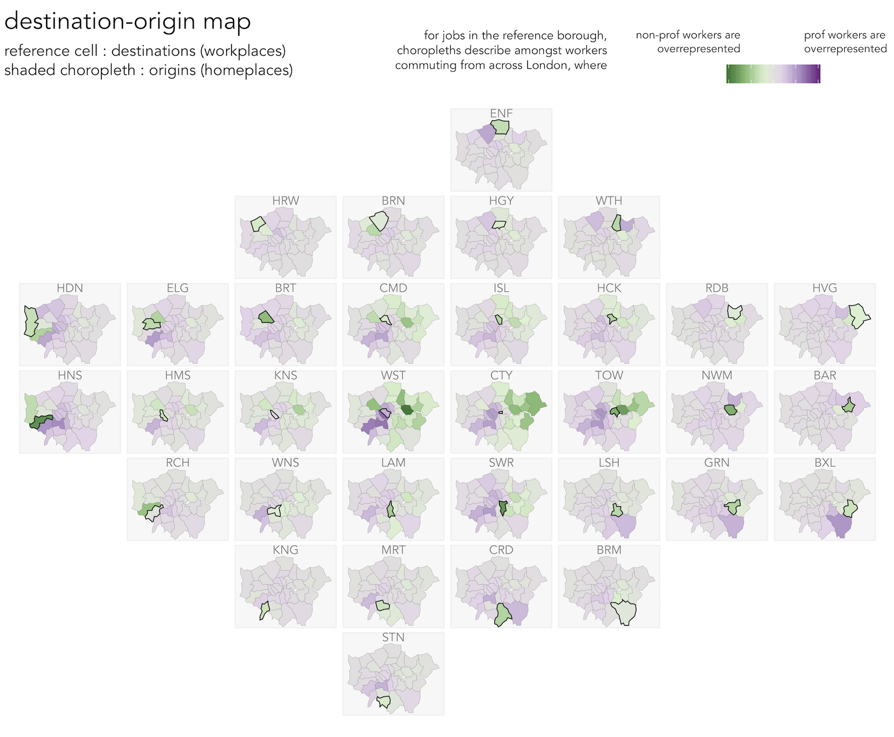

Code to support short graphics special submission: *Characterising labour market self-containment in London with geographically arranged small multiples*
=========================================================================================================================================================

-   [Roger Beecham](http://www.roger-beecham.com)
-   [Aidan Slingsby](http://www.staff.city.ac.uk/~sbbb717/)

This repository contains code behind our submission: *Characterising labour market self-containment in London with geographically arranged small multiples*. The intention was to provide a fully reproducible repository to support the submission. We are not able to do this for reasons of data access: the data on which the submission is based is restricted to registered users of [UK Data Service](https://www.ukdataservice.ac.uk). As a result this repo is non-functional and the code should be considered skeleton/indicative -- but with hopefully useful 'how-to' detail additional to the paper. A previously published repo demonstrating much of what appears below on a version of the dataset that is publicly available, again using R libraries (`ggplot2` and `sf`) is here: [od-flowvis-ggplot2](https://github.com/rogerbeecham/od-flowvis-ggplot2). If you would like more information/help, do get in touch: [rJBeecham](https://twitter.com/rJBeecham).

Dependencies and data
---------------------

Configure R with libraries on which the graphics depend.

``` r
# Libraries

# Bundle of packages supporting Tidy data analysis. 
# -v2.3 of ggplot2 necessary to support geom_sf.
library(tidyverse)
# For working with geometries.
library(sf)
# For simplifying geometries.
library(rmapshaper)
# ggplot2 extension for animated graphics (requires transformr).
library(gganimate)
# Set default ggplot2 theme.
theme_set(theme_minimal(base_family="Avenir Book"))
# Helper functions.
# For rescaling.
map_scale <- function(value, min1, max1, min2, max2) {
  return  (min2+(max2-min2)*((value-min1)/(max1-min1)))
}
```

The graphics are built using the following datasets:

-   OD data by occupation at msoa level from [UK Data Service](https://www.ukdataservice.ac.uk)
-   LondonSquared layout via [After the flood](https://aftertheflood.com/projects/future-cities-catapult/)
-   Boundary data via [ONS Open Geography](http://geoportal.statistics.gov.uk/)

A pre-prepared script for processing these data and generating summary statistics describing *supply-side* and *demand-side* self-containment:

``` r
# Load and process data.
source("./src/load_data.R")
```

Geographically-arranged small multiples
---------------------------------------

Our submission aims to characterise labour market geography in London by analysing 2011 Census data describing commuting between London's 33 boroughs. We present a set of [small multiple](https://en.wikipedia.org/wiki/Small_multiple) (Tufte 1983)-type graphics whereby a separate summary chart is created for each borough and boroughs are arranged in a grid according to their approximate geographic position. The [LondonSquared](https://aftertheflood.com/projects/future-cities-catapult/) arrangement is used here, but see [Meulemans et al. (2017)](https://www.gicentre.net/small-multiples-with-gaps/) for a wider discussion, with generalisable technique for effecting arrangements that try to preserve adjacency relations and overall geometries.

Below we explore distortion in these semi-spatial layouts by morphing between a *real* and *approximate* layout. Code for generating the morph can be viewed in this position of the repo's [READE.Rmd](README.Rmd) file.


A three letter abbreviation is used to identify boroughs. Below is a look-up table for these.

``` r
london_centroids %>% select(authority, BOR) %>% arrange(authority) %>%  print(n=33)
# A tibble: 33 x 2
   authority              BOR  
   <chr>                  <chr>
#  1 Barking and Dagenham   BAR  
#  2 Barnet                 BRN  
#  3 Bexley                 BXL  
#  4 Brent                  BRT  
#  5 Bromley                BRM  
#  6 Camden                 CMD  
#  7 City of London         CTY  
#  8 Croydon                CRD  
#  9 Ealing                 ELG  
# 10 Enfield                ENF  
# 11 Greenwich              GRN  
# 12 Hackney                HCK  
# 13 Hammersmith and Fulham HMS  
# 14 Haringey               HGY  
# 15 Harrow                 HRW  
# 16 Havering               HVG  
# 17 Hillingdon             HDN  
# 18 Hounslow               HNS  
# 19 Islington              ISL  
# 20 Kensington and Chelsea KNS  
# 21 Kingston upon Thames   KNG  
# 22 Lambeth                LAM  
# 23 Lewisham               LSH  
# 24 Merton                 MRT  
# 25 Newham                 NWM  
# 26 Redbridge              RDB  
# 27 Richmond upon Thames   RCH  
# 28 Southwark              SWR  
# 29 Sutton                 STN  
# 30 Tower Hamlets          TOW  
# 31 Waltham Forest         WTH  
# 32 Wandsworth             WNS  
# 33 Westminster            WST   
```

Labour market self-containment
------------------------------

We argue in the short paper that our graphics support analysis into the geography of self-containment in London, a concept of routine interest to economic geographers.

Self-containment is typically quantified using two intuitive indicators: *supply-side* self-containment describes the *share of local working residents* of an area that access jobs in that area rather than commute elsewhere for work; *demand-side* self-containment describes the *share of local jobs* in an area filled by local residents rather than workers commute in from surrounding areas. Behind self-containment summary statistics there is an implied distribution of Origin-Destination (OD) flows: areas with high self-containment exhibit a power-law type distribution whereby most employed residents (supply) and available jobs (demand) are satisfied internally and this tendency becomes less strong as self-containment scores decrease.

Two separate derived datasets are prepared from an OD dataset of borough-borough commutes to support our analysis of self-containment (detailed in [load\_data.R](/src/load_data.R)): a *supply side* dataset that summarises over origins (homeplaces) and a *demand side* dataset that summarises over destinations (workplaces). This is achieved with `group_by`, grouping the full OD dataset by `origin` for the *supply-side* summary and `destination` for the *demand\_side* summary. In this pre-processing we do things like *rank* OD pairs into- and out of- grouped boroughs according to their frequency, calculate the maximum number of commutes into- and out of- boroughs so that local and global scalings can be explored in our graphics.

Self-containment, by occupation, with geographically-arranged bar charts
------------------------------------------------------------------------

We first display self-containment scores directly via geographically-arranged bar charts. The bars differentiate between professional and non-professional occupation types using the [ONS Standard Occupational Classification Hierarchy](https://onsdigital.github.io/dp-classification-tools/standard-occupational-classification/ONS_SOC_hierarchy_view.html).

Code for generating the chart -- the `ggplot2` specification -- can be viewed in this position of the repo's [README.Rmd](README.Rmd) file. We generate separate rectangles for each occupation type by parameterising `geom_rect()`, supplying different colour values to differentiate professional from non-professional occupations. We chose the `geom_rect()` primitive over `geom_bar()` as it allowed greater flexibility over bar placement -- necessary for when we explore overloading of views [(Javed & Elmqvist 2012)](https://ieeexplore.ieee.org/document/6183556) with rank-size area charts. We write a rescaling function (`map_scale()`) for assisting bar sizing and placement. To arrange bars geographically by borough, we supply to `facet_grid()` a set of 2d grid positions corresponding to the LondonSquared layout.


Exposing underlying distributions with geographically arranged rank-size area charts
------------------------------------------------------------------------------------

In order to characterise the diversity with which workers commute out of their home borough for work (supply-side) and jobs within a borough are filled by non-resident workers (demand-side), we tried updating our initial graphic with rank-size area charts.

Left of the vertical line, the area chart displays counts of workers resident in the reference borough filling jobs in that or the 32 neighbouring boroughs, with boroughs ordered bottom-to-top according to frequency. The steeper the slope, the less often residents commute out of the borough for work. Self-containment ratios are also encoded directly with the left aligned bars. Right of the vertical lines are counts of jobs filled in each reference borough either by workers living in the reference borough or by workers commuting in from the 32 neighbouring boroughs. The steeper the slope, the less often are jobs filled by workers commuting into the reference borough, with *demand-side* containment ratios further encoded by the right-aligned bars.

Again, code for generating the chart can be viewed in this position of the repo's [README.Rmd](README.Rmd) file. The general structure of the `ggplot2` specification remains unchanged from that of the geographically-arranged bar charts. However, we represent many more observations since the rank-size area charts display full OD counts of residents commuting out of each borough (left of vertical) and non-residents commuting into each borough (right of vertical). We add the area charts using `geom_area`, supplying the the `x` parameter a `rank` position for each OD pair out of- (supply) and into- (demand) the reference borough and to the `y` position OD pair counts rescaled between 0 and 1 by reference borough.`coord_flip()` is used to orient the bars bottom to top.


Exposing underlying spatial distributions with origin-destination flow maps
---------------------------------------------------------------------------

We explore the additional geography to these distributions using Origin-Destination flow maps (Wood et al, 2010; Slingsby et al. 2014). Here, the area-charts are replaced with choropleth maps and shaded differently according to whether the reference cells correspond to origins (homeplaces) or destinations (workplaces).


In the paper submission there is a reasonably involved discussion of the contingency tables signed chi-square residuals that we calculate in order compare relative frequencies of borough-borough commutes for professional and non-professional occupations. Contingency tables are generated separately for each reference borough and differently based on whether reference boroughs correspond to origins (homeplaces) or destinations (workplaces). The signed chi-square measure has advantages over alternative measures of effect size (such as risk ratios) as saliency is given to relative differences that are also large in absolute magnitude. This effect is necessary since in c.10% of the 1089 borough-borough pairs, fewer than 30 job counts are recorded; we might expect large relative differences between professional vs. non-professional occupations here, and so would register large effect size values if risk ratios were being used – these would nevertheless be comparatively small, and possibly idiosyncratic, differences in absolute terms.

Again, code for calculated can be viewed at the below position in this repo's [README.Rmd](README.Rmd). The general structure of the `ggplot2` specification is again very similar to the previous geographically-arranged bar charts -- we use `facet_grid()` for arranging the choropleths according to their geographic position. However, we now generate a separate map for summarising commutes out of- the reference boroughs (*supply-side OD map*) and into the reference boroughs (*demand-side OD maps*). The choropleths are generated with `geom_sf()`.

### Supply-side OD Map


### Demand-side DO Map



References
----------

-   Javed W. & Elmqvist N. (2012) Exploring the design space of composite visualization. In *Pacific Visualization Symposium* (PacificVis), IEEE, pp. 1–8.

-   Office for National Statistics. 2016. Travel to work area analysis in Great Britain: 2016. ONS, Online.

-   Meulemans, W., Dykes, J., Slingsby, A., Turkay, C. & Wood, J. 2017. Small Multiples with Gaps. *IEEE Transactions on Visualization and Computer Graphics*, 23, pp381–390.

-   Slingsby, A., Kelly, M. & Dykes, J. 2014. . “Featured Graphic. OD maps for showing changes in Irish female migration between 1851 and 1911”, *Environment and Planning A*, 46, pp2795-2797.

-   Tufte, E. 1983. *The Visual Display of Quantitative Information*, Graphics Press Cheshire, CT.

-   Wood, J., Dykes, J., Slingsby, A. 2010. “Visualization of Origins, Destinations and Flows with OD Maps”, *The Cartographic Journal*, 47 (2) pp117-129.
