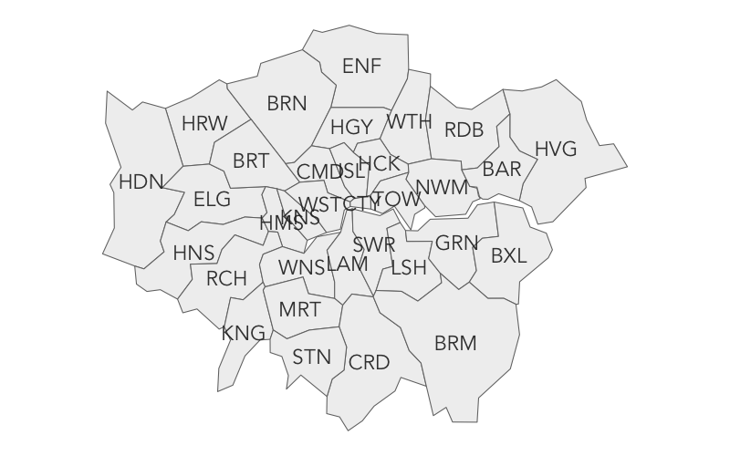
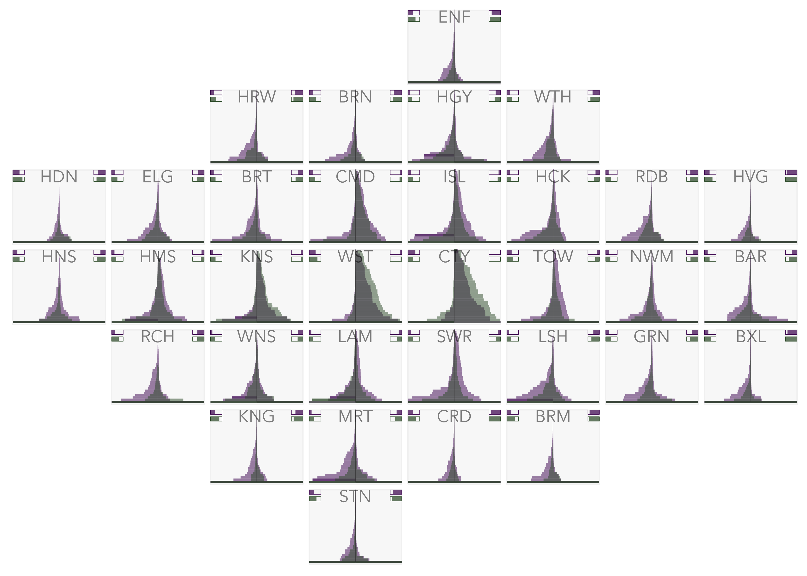
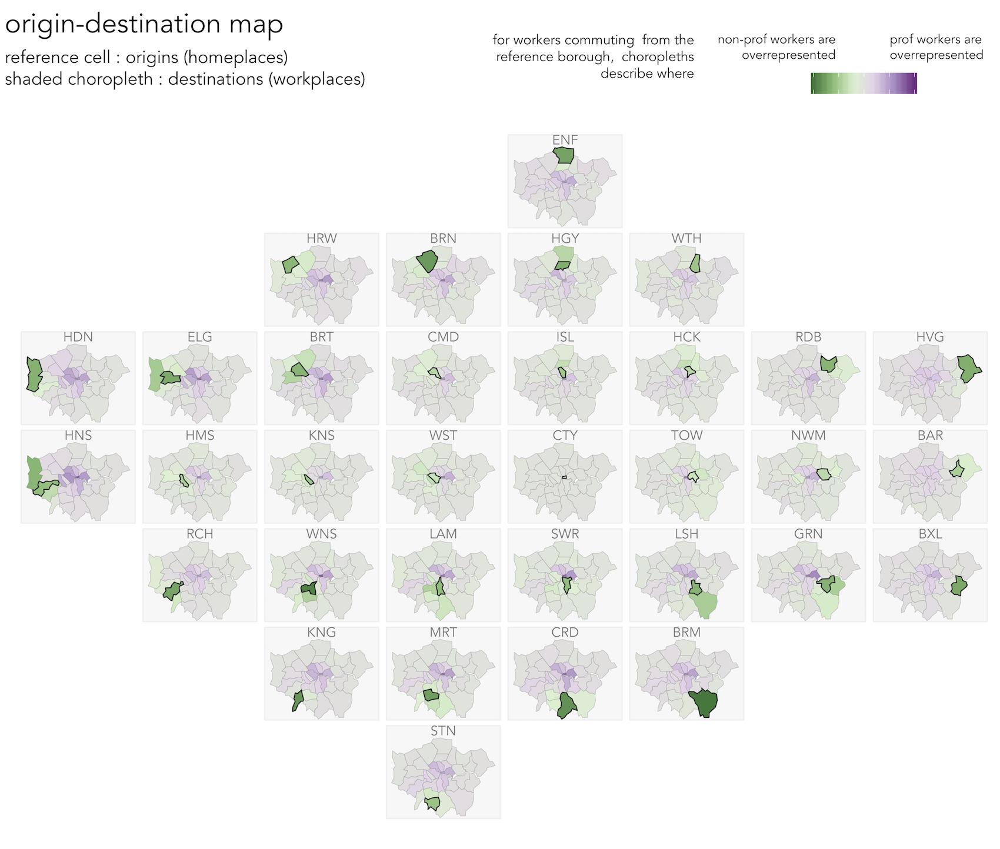

Dependencies and data
---------------------

Configure R with libraries on which featured graphic depends and helper functions.

``` r
# Libraries

# Bundle of packages supporting Tidy data analysis. 
# -v2.3 of ggplot2 necessary to support geom_sf.
library(tidyverse)
# For working with geometries.
library(sf)
# For simplifying geometries.
library(rmapshaper)
# ggplot2 extension for beziers.
library(ggforce)
# ggplot2 extension for animated graphics (requires transformr).
library(gganimate)
# Set default ggplot2 theme.
theme_set(theme_minimal(base_family="Avenir Book"))
# Helper functions.
# For rescaling.
map_scale <- function(value, min1, max1, min2, max2) {
  return  (min2+(max2-min2)*((value-min1)/(max1-min1)))
}
```

Load and process data: \* OD data by occupation at msoa level from [UK Data Service](https://www.ukdataservice.ac.uk) \* LondonSquared layout via [After the flood](https://aftertheflood.com/projects/future-cities-catapult/) \* Boundary data via [ONS Open Geography](http://geoportal.statistics.gov.uk/)

``` r
# Data

# Origin-Desination data by occupation published via UK Data Service. 
# https://www.ukdataservice.ac.uk
data <- read_csv("./data/wicid_output_occupation.csv")
# Get msoa_lad lookup.
# From: https://ons.maps.arcgis.com/home/item.html?id=552fd4886ebe417fab71da61555d4f8a
temp_lookup <-  read_csv("./data/msoa_lad_lookup.csv") %>% 
  rename("msoa_code"="MSOA11CD") %>%
  group_by(msoa_code) %>% 
  summarise(msoa_name=first(MSOA11NM),
            lad_code=first(LAD11CD),
            lad_name=first(LAD11NM))
# Upload london_squared layout: https://aftertheflood.com/projects/future-cities-catapult/ 
london_squared <- read_csv("./data/london_squared.csv") %>% select(fX,fY, authority, BOR, panel) %>% mutate(panel=as.factor(panel))
# Reverse northing cells.
max_y <- max(london_squared$fY)
min_y <- min(london_squared$fY)
london_squared <- london_squared %>% mutate(fY=map_scale(fY, min_y, max_y, max_y, min_y))
rm(min_y,max_y)
# Inner_join on london_squared and temp_lookup to filter out London msoas in lookup table.
temp_lookup <- temp_lookup %>% inner_join(london_squared %>% select(authority), by=c("lad_name"="authority"))
# Lookup to LAD: summarise over occupation.
data <- data %>% 
  # origin lookup
  inner_join(temp_lookup, by=c("origin_msoa"="msoa_code")) %>% 
  rename("o_msoa"="origin_msoa", "o_lad"="lad_code") %>% 
  select(o_msoa:`9_elementary`,o_lad) %>%
  # destination lookup
  inner_join(temp_lookup, by=c("destination_msoa"="msoa_code")) %>% rename("d_msoa"="destination_msoa", "d_lad"="lad_code") %>%
  select(-msoa_name)
rm(temp_lookup)
# London has 983 msoas, so can check lookup with.
data %>% group_by(o_msoa) %>% summarise() %>% nrow() 
# And 33 LADs.
data %>% group_by(o_lad) %>% summarise() %>% nrow() 
# Summarise over LADs : on occupation
data <- data %>% 
  mutate(od_pair=paste(o_lad, d_lad, sep="-")) %>%
  group_by(od_pair, o_lad, d_lad) %>%
  summarise_at(vars(all:`9_elementary`), funs(sum(.)))
data <- data %>% ungroup()
# Read in shapefile containing GB LAD boundaries. 
# Made available from ONS Open Geography Portal. 
download.file("http://geoportal.statistics.gov.uk/datasets/8edafbe3276d4b56aec60991cbddda50_3.zip", "boundaries_gb.zip")
unzip("boundaries_gb.zip")
gb_boundaries <- read_sf("Local_Authority_Districts_December_2015_Super_Generalised_Clipped_Boundaries_in_Great_Britain.shp")
# Set CRS to OSGB.
gb_boundaries <- st_transform(gb_boundaries, crs=27700)
# Simplify polygon.
gb_boundaries <- ms_simplify(gb_boundaries, keep=0.2)
# Inner_join with data to filter London LADs.
temp_london_lads <- data %>% group_by(o_lad) %>% summarise()  %>% rename("ladcd"="o_lad")
london_boundaries <- gb_boundaries %>%
  inner_join(temp_london_lads, by=c("lad15cd"="ladcd")) 
rm(gb_boundaries)
# Calculate real centroids of LADs.
london_centroids <- london_boundaries %>%
  st_centroid() %>%
  st_coordinates() %>%
  as_tibble() %>%
  rename("east"="X", "north"="Y") %>%
  add_column(ladcd=london_boundaries %>% pull(lad15cd))
# Add centroids to OD data.
data <- data %>% left_join(london_centroids %>% select(east, north, ladcd), by=c("o_lad"="ladcd")) %>% rename("o_east"="east", "o_north"="north")
data <- data %>% left_join(london_centroids %>% select(east, north, ladcd), by=c("d_lad"="ladcd")) %>% rename("d_east"="east", "d_north"="north")
# Add in london_squared data.
london_centroids <- london_centroids %>% add_column(ladnm=london_boundaries %>% pull(lad15nm)) %>% 
  left_join(london_squared, by=c("ladnm"="authority"))
# Add fX fY postions for OD data.
data <- data %>% 
  left_join(london_centroids %>% select(ladcd, fX, fY, BOR), by=c("o_lad"="ladcd")) %>% 
  rename("o_fX"="fX", "o_fY"="fY", "o_bor"="BOR") %>%
  left_join(london_centroids %>% select(ladcd, fX, fY, BOR), by=c("d_lad"="ladcd")) %>% 
  rename("d_fX"="fX", "d_fY"="fY", "d_bor"="BOR")
```

Prep data for demand-side- and supply-side summaries
----------------------------------------------------

``` r
# Demand-side summary.
demand_side <- data %>% 
  group_by(od_pair) %>%
  mutate(
    prof=sum(`1_managers_senior`,`2_professional`, `3_associate_professional`),
    non_prof=all-prof
  ) %>%
  ungroup() %>%
  select(od_pair, d_bor, o_bor, d_fY, d_fX, o_fY, o_fX, o_lad, d_lad, prof, non_prof) %>%
  group_by(d_bor) %>%
  mutate(
    prof_total_jobs=sum(prof), 
    # Jobs filled by local residents.
    prof_demand_side=if_else(o_bor==d_bor, prof/prof_total_jobs,0), 
    prof_max_jobs=max(prof),
    prof_rank=row_number(desc(prof)), 
    non_prof_total_jobs=sum(non_prof), 
    # Jobs filled by local residents.
    non_prof_demand_side=if_else(o_bor==d_bor, non_prof/non_prof_total_jobs,0), 
    non_prof_rank=row_number(desc(non_prof)), 
    non_prof_max_jobs=max(non_prof),
    bor_label=if_else(d_bor==o_bor,d_bor,"")) %>%
  ungroup() %>%  
  rename("bor_focus"="d_bor", "fY"="d_fY", "fX"="d_fX") 

# Supply-side summary.
supply_side <- data %>%
  group_by(od_pair) %>%
  mutate(
    prof=sum(`1_managers_senior`,`2_professional`, `3_associate_professional`),
    non_prof=all-prof
  ) %>%
  ungroup() %>%
  select(od_pair, d_bor, o_bor, o_fY, o_fX, d_fX, d_fY, o_lad, d_lad, prof, non_prof) %>%
  group_by(o_bor) %>%
  mutate(
    prof_total_workers=sum(prof), 
    prof_supply_side=if_else(o_bor==d_bor, prof/prof_total_workers,0), 
    prof_rank=row_number(desc(prof)), 
    prof_max_workers=max(prof),
    non_prof_total_workers=sum(non_prof), 
    non_prof_supply_side=if_else(o_bor==d_bor, non_prof/non_prof_total_workers,0), 
    non_prof_rank=row_number(desc(non_prof)), 
    non_prof_max_workers=max(non_prof),
    bor_label=if_else(d_bor==o_bor,d_bor,"")) %>% 
  ungroup() %>%  
  rename("bor_focus"="o_bor", "fY"="o_fY", "fX"="o_fX")
```

Explore extent of distortion in LondonSquared layout
----------------------------------------------------



``` r
# Make sf object of LondonSquared layout
grid_sf <- st_sf(geom=st_make_grid(london_boundaries, n=c(8,7), what="polygons")) %>% mutate(id=row_number())
# Store gid cell locations and add as fields.
x <- rep(1:8,7)
y <- vector(length=length(x))
for(i in 1:7) {
      for(j in 1:8) {
       index=(i-1)*8+j
       y[index] <- map_scale(i,1,7,7,1)
      }  
  }
grid_sf <- grid_sf %>% add_column(x=x, y=y) %>% 
  inner_join(london_centroids, by=c("x"="fX", "y"="fY")) %>% 
  st_cast(to="MULTIPOLYGON") %>% 
  rename("geometry"="geom") %>%
  arrange(panel) %>%
  mutate(id=row_number(), type="grid") 
# Calculate grid centroids for relabelling.
grid_centroids <- grid_sf %>% st_centroid() %>% st_coordinates() %>% as_tibble() %>% rename("east"="X", "north"="Y")
# Add to grid_sf
grid_sf <- grid_sf %>%
  mutate(east=grid_centroids$east, north=grid_centroids$north)
rm(grid_centroids)  
# Copy if london_boundaries with same fields as grid_sf for rbind().
real_sf <- london_boundaries %>% select(lad15cd) %>%
  left_join(london_centroids, by=c("lad15cd"="ladcd")) %>%
    arrange(panel) %>%
    mutate(id=row_number(), x=fX, y=fY, type="real") %>%
    select(id,x,y,east,north,ladcd=lad15cd,ladnm,BOR,panel,type) 
# rbind() in order to lerp between layouts.
grid_real_sf <- rbind(grid_sf,real_sf) %>% 
  mutate(type=fct_relevel(as_factor(type), "real","grid"))
# Animate between two layouts using gganimate package.
grid_real_sf %>%
  ggplot()+
  geom_sf(fill="#f0f0f0", colour="#737373", size=0.5)+ 
  coord_sf(datum=NA)+
  geom_text(aes(x=east, y=north, label=BOR), size=8, colour="#252525", alpha=0.9, show.legend=FALSE, family="Avenir Book")+
  transition_states(type, 1, 2)+
  theme(axis.title=element_blank())

animate(trans, renderer = gifski_renderer("./figures/gganim.gif"), height = 500, width=800)
```

Rank-size distributions
-----------------------

### Using area charts


``` r
local_scale_distributions_area <- ggplot()+
  # Facet background.
  geom_rect(data=demand_side, aes(xmin=0, xmax=33, ymin=-1, ymax=1), fill="#f7f7f7", colour="#f0f0f0")+
  # Lines for distributions.
  geom_line(data=demand_side, aes(x=prof_rank, y=prof/prof_max_jobs), colour="#40004b", alpha=0.9, size=0.4)+
  geom_line(data=demand_side, aes(x=non_prof_rank, y=non_prof/non_prof_max_jobs), colour="#00441b", alpha=0.9, size=0.4)+
  geom_line(data=supply_side, aes(x=prof_rank, y=-prof/prof_max_workers), colour="#40004b", alpha=0.9, size=0.4)+
  geom_line(data=supply_side, aes(x=non_prof_rank, y=-non_prof/non_prof_max_workers), colour="#00441b", alpha=0.9, size=0.4)+
  # Areas for distributions.
  geom_area(data=demand_side, aes(x=prof_rank, y=prof/prof_max_jobs), fill="#40004b", alpha=0.3)+
  geom_area(data=demand_side, aes(x=non_prof_rank, y=non_prof/non_prof_max_jobs), fill="#00441b", alpha=0.3)+
  geom_area(data=supply_side, aes(x=prof_rank, y=-(prof/prof_max_workers)),fill="#40004b", alpha=0.3)+
  geom_area(data=supply_side, aes(x=non_prof_rank, y=-(non_prof/non_prof_max_workers)), fill="#00441b", alpha=0.3)+
  # Text labels for boroughs.
  geom_text(data=demand_side, aes(x=33, y=0, label=bor_label), family="Avenir Book", alpha=0.5, hjust="centre", vjust="top", size=6)+
  geom_rect(data=supply_side %>% filter(d_bor==bor_focus), aes(xmin=31, xmax=33, ymin=-1, ymax=-1+0.25*(prof_supply_side/0.7)), alpha=0.7, fill="#40004b")+
  geom_rect(data=supply_side %>% filter(d_bor==bor_focus), aes(xmin=31, xmax=33, ymin=-1, ymax=-0.75), colour="#40004b", size=0.2, fill="transparent")+
  geom_rect(data=supply_side %>% filter(d_bor==bor_focus), aes(xmin=28, xmax=30, ymin=-1, ymax=-1+0.25*(non_prof_supply_side/0.7)), alpha=0.7, fill="#00441b")+
  geom_rect(data=supply_side %>% filter(d_bor==bor_focus), aes(xmin=28, xmax=30, ymin=-1, ymax=-0.75), colour="#00441b", size=0.2, fill="transparent")+
  geom_rect(data=demand_side %>% filter(o_bor==bor_focus), aes(xmin=31, xmax=33, ymin=1, ymax=1-0.25*(prof_demand_side/0.7)), fill="#40004b", alpha=0.7)+
  geom_rect(data=demand_side %>% filter(o_bor==bor_focus), aes(xmin=31, xmax=33, ymin=1, ymax=0.75), colour="#40004b", size=0.2, fill="transparent")+
  geom_rect(data=demand_side %>% filter(o_bor==bor_focus), aes(xmin=28, xmax=30, ymin=1, ymax=1-0.25*(non_prof_demand_side/0.7)), fill="#00441b", alpha=0.7)+
  geom_rect(data=demand_side %>% filter(o_bor==bor_focus), aes(xmin=28, xmax=30, ymin=1, ymax=0.75), colour="#00441b", size=0.2, fill="transparent")+
  # Centre line : demand-side to right, supply-side to left.
  geom_line(data=demand_side, aes(x=prof_rank, y=0), colour="#000000", size=0.3)+
  coord_flip()+
  facet_grid(fY~fX)+
  guides(alpha=FALSE)+
  theme(
    axis.title=element_blank(), 
    axis.text=element_blank(),
    panel.grid=element_blank(),
    strip.text=element_blank(),
    panel.spacing=unit(-0.2, "lines"),
  ) 
```

### Using bar charts



``` r
local_scale_distributions_bars <- ggplot()+
  # Facet background.
  geom_rect(data=demand_side, aes(xmin=0, xmax=33, ymin=-1, ymax=1), fill="#f7f7f7", colour="#f0f0f0")+
 # Bars : prof.
  geom_col(data=demand_side, aes(x=prof_rank, y=prof/prof_max_jobs), fill="#40004b", alpha=0.5, width=1, size=0.2)+
  geom_col(data=supply_side, aes(x=prof_rank, y=-prof/prof_max_workers), fill="#40004b", alpha=0.5, width=1, size=0.2)+
  # Bars for same OD : prof.
    geom_col(data=supply_side %>% filter(bor_focus==d_bor), aes(x=prof_rank, y=-prof/prof_max_workers), fill="#40004b", alpha=0.5, width=1, size=0.2)+
  geom_col(data=demand_side %>% filter(bor_focus==o_bor), aes(x=prof_rank, y=prof/prof_max_jobs), fill="#40004b", alpha=0.5, width=1, size=0.2)+
  # Bars : non-prof.
  geom_col(data=supply_side, aes(x=non_prof_rank, y=-non_prof/non_prof_max_workers), fill="#00441b", alpha=0.5, width=1, size=0.2)+
  geom_col(data=demand_side, aes(x=non_prof_rank, y=non_prof/non_prof_max_jobs), fill="#00441b", alpha=0.5, width=1, size=0.2)+
  # Bars for same OD
  geom_col(data=demand_side %>% filter(bor_focus==o_bor), aes(x=non_prof_rank, y=non_prof/non_prof_max_jobs), fill="#00441b", alpha=0.5, width=1, size=0.2)+
  geom_col(data=supply_side %>% filter(bor_focus==d_bor), aes(x=non_prof_rank, y=-non_prof/non_prof_max_workers), fill="#00441b", alpha=0.5, width=1, size=0.2)+
 # Text labels for boroughs.
  geom_text(data=demand_side, aes(x=33, y=0, label=bor_label), family="Avenir Book", alpha=0.5, hjust="centre", vjust="top", size=6)+
  geom_rect(data=supply_side %>% filter(d_bor==bor_focus), aes(xmin=31, xmax=33, ymin=-1, ymax=-1+0.25*(prof_supply_side/0.7)), alpha=0.7, fill="#40004b")+
  geom_rect(data=supply_side %>% filter(d_bor==bor_focus), aes(xmin=31, xmax=33, ymin=-1, ymax=-0.75), colour="#40004b", size=0.2, fill="transparent")+
  geom_rect(data=supply_side %>% filter(d_bor==bor_focus), aes(xmin=28, xmax=30, ymin=-1, ymax=-1+0.25*(non_prof_supply_side/0.7)), alpha=0.7, fill="#00441b")+
  geom_rect(data=supply_side %>% filter(d_bor==bor_focus), aes(xmin=28, xmax=30, ymin=-1, ymax=-0.75), colour="#00441b", size=0.2, fill="transparent")+
  geom_rect(data=demand_side %>% filter(o_bor==bor_focus), aes(xmin=31, xmax=33, ymin=1, ymax=1-0.25*(prof_demand_side/0.7)), fill="#40004b", alpha=0.7)+
  geom_rect(data=demand_side %>% filter(o_bor==bor_focus), aes(xmin=31, xmax=33, ymin=1, ymax=0.75), colour="#40004b", size=0.2, fill="transparent")+
  geom_rect(data=demand_side %>% filter(o_bor==bor_focus), aes(xmin=28, xmax=30, ymin=1, ymax=1-0.25*(non_prof_demand_side/0.7)), fill="#00441b", alpha=0.7)+
  geom_rect(data=demand_side %>% filter(o_bor==bor_focus), aes(xmin=28, xmax=30, ymin=1, ymax=0.75), colour="#00441b", size=0.2, fill="transparent")+
  # Centre line : demand-side to right, supply-side to left.
  geom_line(data=demand_side, aes(x=prof_rank, y=0), colour="#252525", size=0.1)+
  coord_flip()+
  facet_grid(fY~fX)+
  guides(alpha=FALSE)+
  theme(
    axis.title=element_blank(), 
    axis.text=element_blank(),
    panel.grid=element_blank(),
    strip.text=element_blank(),
    panel.spacing=unit(-0.2, "lines"),
  )
```

OD Maps
-------

### Supply-side OD Map



``` r
# Spatially ordered choropleths
# Calculate bottom corner of London.
data_temp <- london_boundaries  %>% st_coordinates() %>% as_tibble() %>% select(X,Y) %>% rename("lon_east"="X", "lon_north"="Y") %>% summarise(max_east=max(lon_east), min_east=min(lon_east), max_north=max(lon_north), min_north=min(lon_north)) 
# Add to london_boundarues.
london_boundaries <- london_boundaries %>%
  mutate(lon_east_max=data_temp$max_east, lon_east_min=data_temp$min_east, lon_north_min=data_temp$min_north, lon_north_max=data_temp$max_north)
rm(data_temp) 
# Create df for plotting. 
plot_data_temp <- supply_side %>%
  group_by(bor_focus) %>%
  mutate(
    expected=((prof+non_prof+0.0001)*(sum(prof)+0.0001))/(sum(prof)+sum(non_prof)+0.0001),
    pearson=(prof-expected)/(sqrt(expected)),
    count=pearson) %>% 
  ungroup() %>%
  mutate(f_od=abs(count)/max(abs(count)), f_od_colour=if_else(count<0,-f_od,f_od))
plot_data_temp <- london_boundaries %>% right_join(plot_data_temp, by=c("lad15cd"="d_lad"))
plot_data_focus <- london_boundaries %>% right_join(demand_side %>% filter(o_lad==d_lad), by=c("lad15cd"="d_lad"))
# width
width <- plot_data_temp %>% summarise(width=first(lon_east_max)-first(lon_east_min)) %>% select(width) %>% pull(width)
# height
height <- plot_data_temp %>% summarise(height=first(lon_north_max)-first(lon_north_min)) %>% select(height) %>% pull(height)

# Plot choropleth.
od_pearson_local_choropleth_supply <- ggplot()+
  geom_rect(data=plot_data_temp %>% filter(bor_label!=""), aes(xmin=lon_east_min-0.05*width, xmax=lon_east_max+0.05*width, ymin=lon_north_min-0.01*height, ymax=lon_north_max+0.15*height),  fill="#f7f7f7", colour="#f0f0f0")+ 
  geom_sf(data=plot_data_temp, aes(fill=f_od_colour), colour="#636363", size=0.01)+
  geom_sf(data=plot_data_focus, fill="transparent",  colour="#252525", size=0.4)+
  geom_text(data=plot_data_temp, aes(x=lon_east_min+0.5*width, y=lon_north_max+0.15*height, label=bor_label), hjust="centre", vjust="top", size=4, alpha=0.5, show.legend=FALSE, family="Avenir Book")+
  coord_sf(crs=st_crs(plot_data_temp), datum=NA)+
  scale_fill_distiller(palette="PRGn", direction=-1, limits=c(-1,1))+
  facet_grid(fY~fX, shrink=FALSE)+
  guides(fill=FALSE)+
  theme(
    panel.spacing=unit(-0.2, "lines"),
    axis.title=element_blank(),
    strip.text=element_blank())
```

### Demand-side DO Map


``` r
# Create df for plotting : demand-side
plot_data_temp <- demand_side %>%
  group_by(bor_focus) %>%
  mutate(
    expected=((prof+non_prof+0.0001)*(sum(prof)+0.0001))/(sum(prof)+sum(non_prof)+0.0001),
    pearson=(prof-expected)/(sqrt(expected)),
    count=pearson) %>%
  ungroup() %>%
  mutate(f_od=((abs(count)/max(abs(count)))^1), f_od_colour=if_else(count<0,-f_od,f_od)) 
plot_data_temp <- london_boundaries %>% right_join(plot_data_temp, by=c("lad15cd"="o_lad"))
plot_data_focus <- london_boundaries %>% right_join(demand_side %>% filter(o_lad==d_lad), by=c("lad15cd"="o_lad"))
# Plot choropleth : demand-side
od_pearson_local_choropleth_demand <- ggplot()+
  geom_rect(data=plot_data_temp %>% filter(bor_label!=""), aes(xmin=lon_east_min-0.05*width, xmax=lon_east_max+0.05*width, ymin=lon_north_min-0.01*height, ymax=lon_north_max+0.15*height),  fill="#f7f7f7", colour="#f0f0f0")+ 
  geom_sf(data=plot_data_temp, aes(fill=f_od_colour), colour="#636363", size=0.01)+
  geom_sf(data=plot_data_focus, fill="transparent",  colour="#252525", size=0.4)+
  geom_text(data=plot_data_temp, aes(x=lon_east_min+0.5*width, y=lon_north_max+0.15*height, label=bor_label), hjust="centre", vjust="top", size=4, alpha=0.5, show.legend=FALSE, family="Avenir Book")+
  coord_sf(crs=st_crs(plot_data_temp), datum=NA)+
  scale_fill_distiller(palette="PRGn", direction=-1, limits=c(-1,1))+
  facet_grid(fY~fX, shrink=FALSE)+
  guides(fill=FALSE)+
  theme(
    panel.spacing=unit(-0.2, "lines"),
    axis.title=element_blank(),
    strip.text=element_blank())
```
